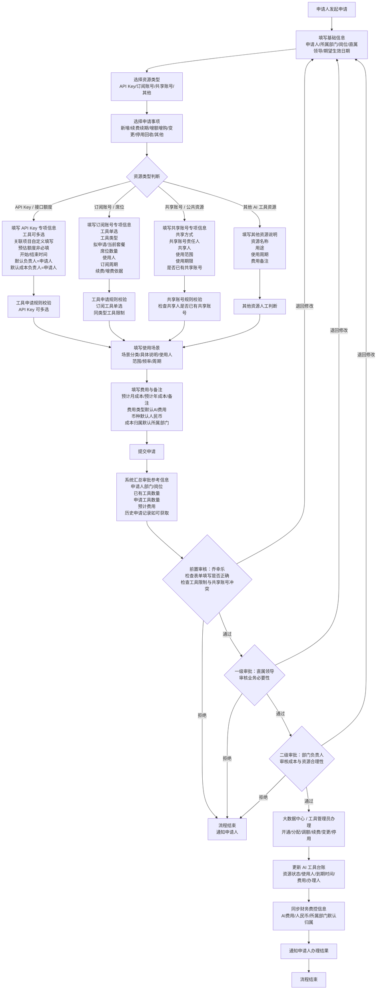

# AI工具申请审批流程V1

## 1. 文档范围
本版本覆盖 API Key / 接口额度、订阅账号 / 席位、共享账号 / 公共资源、其他 AI 工具资源四类申请；覆盖新增、续费 / 续期、增额 / 增购、变更、停用 / 回收、其他六类事项。

> V1 不包含：数据安全分级、敏感数据识别、法务合规审批、供应商安全评估、复杂金额阈值审批、自动用量监控、复杂成本摊销逻辑（仅可作为 V2 预留）。

## 2. 审批主流程
流程节点：
申请人提交 → 乔幸乐前置审核 → 直属领导审批 → 部门负责人审批 → 大数据中心/工具管理员办理 → 同步台账/财务费控信息 → 通知申请人 → 结束。

每个审核/审批节点均支持：通过、退回修改、拒绝。

## 3. Mermaid 流程图
见 `flowchart.mmd`：



## 4. 审批参考信息汇总（审核前展示）
- 申请人、所属部门、岗位/职位、直属领导
- 资源类型、申请事项、申请工具数量
- 预计月成本、预计年成本
- 申请人当前已有订阅工具/API Key/共享账号参与情况
- 同类型工具冲突提示、共享账号冲突提示
- 历史申请记录（可获取时）

实现优先级：
1. 飞书原生审批 + 多维表格字段引用。
2. 无法自动查询时，展示台账链接或人工检查提示。
3. 若有自建应用 / VIBE coding，则补充自动汇总。

## 5. 核心规则
- 不再填写成本归属字段；默认取申请人所属部门。
- 费用类型默认 AI 费用；币种统一人民币；费用说明统一写入备注。
- API Key 分支不展示后台调用量查看/负责人/成本负责人相关字段。
- API Key 工具允许多选，关联项目必填，预估额度非必填。
- 订阅账号工具必须单选，且同类型订阅工具存在冲突提示机制。
- 共享账号必须填写共享人，需进行共享人同类型账号冲突检查。

## 6. 技术实现边界
### 6.1 飞书原生审批优先
适用：字段配置、条件显隐、审批人配置、退回/拒绝、通知、多维表格同步。

### 6.2 自建应用 / VIBE coding 兜底
适用：历史工具数量查询、订阅同类型冲突自动校验、共享人冲突自动校验、审批摘要自动生成、财务费控对接、台账自动同步。

### 6.3 飞书联系人与组织关系
需预留/实现：申请人、部门、岗位、直属领导、小组成员、审批节点人员的获取能力。

### 6.4 财务费控对接规则
- 费用类型 = AI 费用
- 币种 = 人民币 (CNY)
- 成本归属部门 = 申请人所属部门
- 费用备注 = 表单备注

## 7. Mermaid 渲染（可选）
如仓库环境支持 Mermaid CLI，可执行：

```bash
npx @mermaid-js/mermaid-cli -i docs/ai-tool-approval-v1/flowchart.mmd -o docs/ai-tool-approval-v1/AI工具申请审批流程V1.svg
```

若环境无 Mermaid CLI 或无法联网安装依赖，不阻塞 V1，上线时保留 `.mmd` 文件即可。
