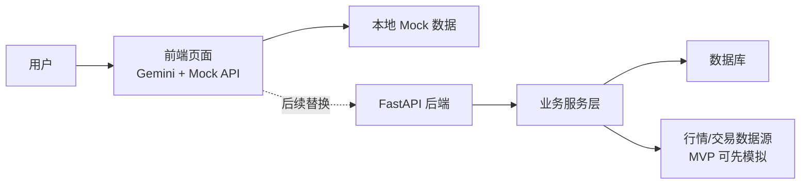

# 股票交易系统 3.0 MVP 简化方案

## 1. 架构设计

### 目标

先完成一个可演示、可联调、可扩展的最小版本。前端由 Gemini 使用 mock 数据生成，后端负责 FastAPI 服务、核心业务接口和接口契约。后续合并时，将前端 mock API 替换为真实接口。

### MVP 架构



### 分工边界

- 前端：先由 Gemini 生成静态/半动态页面，使用 mock 数据完成交互演示。
- 后端：实现 FastAPI 接口、数据模型、业务逻辑和接口文档。
- 合并：前端保留页面和组件，将 mock API 替换为真实 HTTP 请求。

## 2. 产品方案

### MVP 核心功能

1. 用户查看股票列表。
2. 用户查看单只股票详情。
3. 用户查看账户资产概览。
4. 用户查看持仓列表。
5. 用户提交模拟买入/卖出订单。
6. 用户查看订单记录。

### 页面建议

- 首页/行情页：展示股票列表、价格、涨跌幅、成交量。
- 股票详情页：展示基础信息、价格走势占位、买卖入口。
- 交易页：选择股票、买入/卖出、输入数量和价格。
- 资产页：展示现金余额、总资产、持仓盈亏。
- 订单页：展示订单状态和历史记录。

## 3. 后端范围

### MVP 后端职责

- 提供股票行情查询接口。
- 提供账户资产查询接口。
- 提供持仓查询接口。
- 提供订单创建接口。
- 提供订单列表查询接口。
- 定义统一响应结构和错误格式。

### 暂不实现

- 真实证券账户登录。
- 真实交易所下单。
- 实时行情推送。
- 复杂风控系统。
- 多用户权限体系。
- 资金真实出入金。

### 技术建议

- Web 框架：FastAPI
- 数据校验：Pydantic
- 数据库：SQLite 或 PostgreSQL
- ORM：SQLAlchemy 或 SQLModel
- API 文档：FastAPI OpenAPI/Swagger

## 4. 前后端 API 契约

### 统一响应

```json
{
  "code": 0,
  "message": "success",
  "data": {}
}
```

### 错误响应

```json
{
  "code": 40001,
  "message": "Invalid request",
  "data": null
}
```

### 股票列表

`GET /api/stocks`

响应示例：

```json
{
  "code": 0,
  "message": "success",
  "data": [
    {
      "symbol": "AAPL",
      "name": "Apple Inc.",
      "price": 189.5,
      "change": 1.2,
      "changePercent": 0.64,
      "volume": 12000000
    }
  ]
}
```

### 股票详情

`GET /api/stocks/{symbol}`

响应示例：

```json
{
  "code": 0,
  "message": "success",
  "data": {
    "symbol": "AAPL",
    "name": "Apple Inc.",
    "price": 189.5,
    "open": 187.2,
    "high": 191.1,
    "low": 186.8,
    "volume": 12000000
  }
}
```

### 账户资产

`GET /api/account/summary`

响应示例：

```json
{
  "code": 0,
  "message": "success",
  "data": {
    "cash": 100000,
    "marketValue": 25000,
    "totalAssets": 125000,
    "profitLoss": 3200,
    "profitLossPercent": 2.63
  }
}
```

### 持仓列表

`GET /api/positions`

响应示例：

```json
{
  "code": 0,
  "message": "success",
  "data": [
    {
      "symbol": "AAPL",
      "name": "Apple Inc.",
      "quantity": 100,
      "avgPrice": 180,
      "currentPrice": 189.5,
      "marketValue": 18950,
      "profitLoss": 950
    }
  ]
}
```

### 创建订单

`POST /api/orders`

请求示例：

```json
{
  "symbol": "AAPL",
  "side": "buy",
  "orderType": "limit",
  "price": 188.5,
  "quantity": 10
}
```

响应示例：

```json
{
  "code": 0,
  "message": "success",
  "data": {
    "orderId": "ord_001",
    "symbol": "AAPL",
    "side": "buy",
    "status": "submitted",
    "price": 188.5,
    "quantity": 10,
    "createdAt": "2026-05-15T10:00:00Z"
  }
}
```

### 订单列表

`GET /api/orders`

响应示例：

```json
{
  "code": 0,
  "message": "success",
  "data": [
    {
      "orderId": "ord_001",
      "symbol": "AAPL",
      "side": "buy",
      "status": "submitted",
      "price": 188.5,
      "quantity": 10,
      "createdAt": "2026-05-15T10:00:00Z"
    }
  ]
}
```

## 5. 给 Gemini 生成前端的功能描述

请生成一个股票交易系统 3.0 的前端 MVP，使用 mock 数据完成页面交互。不要接真实后端。

需要包含以下页面：

1. 行情列表页：展示股票代码、名称、价格、涨跌幅、成交量。
2. 股票详情页：展示股票基础信息、价格信息、走势区域占位、买入/卖出入口。
3. 交易页：支持选择股票、买入/卖出、限价单、数量输入、提交订单。
4. 资产页：展示现金、持仓市值、总资产、盈亏。
5. 持仓页：展示股票代码、名称、数量、成本价、现价、市值、盈亏。
6. 订单页：展示订单历史、订单状态、买卖方向、价格和数量。

前端需要将所有 mock API 封装在独立模块中，例如 `src/api/mockApi.ts`。后续真实后端完成后，只替换 API 层，不大改 UI 组件。

建议 API 方法：

- `getStocks()`
- `getStockDetail(symbol)`
- `getAccountSummary()`
- `getPositions()`
- `createOrder(payload)`
- `getOrders()`

## 6. 后续前后端合并方式

### 合并原则

前端页面和组件尽量保持不变，只替换数据来源。

### 合并步骤

1. 后端启动 FastAPI 服务，确认 Swagger 文档可访问。
2. 前端新增真实 API 客户端，例如 `src/api/httpApi.ts`。
3. 将 `mockApi.ts` 中的方法逐步替换为真实 HTTP 请求。
4. 保持返回数据结构与本契约一致，减少前端改动。
5. 联调股票列表、详情、账户、持仓、订单创建、订单列表。
6. 发现字段不一致时，优先调整后端响应或 API adapter，不直接扩散到 UI 组件。

### 推荐目录约定

```text
frontend/
  src/
    api/
      mockApi.ts
      httpApi.ts
    pages/
    components/

backend/
  app/
    main.py
    routers/
    schemas/
    services/
    models/
```

## 7. 当前结论

前端先由 Gemini 使用 mock 数据生成，后端专注 FastAPI 和接口契约。等双方完成后，通过替换前端 API 层完成合并。
